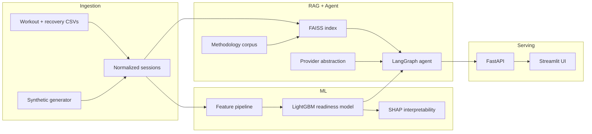

# Lifting Coach Agent

An ML + GenAI system that ingests strength-training logs plus recovery signals (sleep, calorie intake), trains a model to predict **session readiness/performance**, and exposes an **LLM agent** that answers natural-language coaching questions by querying the model, history, and methodology corpus.

**Portfolio goal:** Demonstrate MLE Co-Op (LLM/GenAI team) skills — trained tabular ML, LangGraph agent, RAG/FAISS, eval harness, Docker deploy, provider-swappable local LLM.

**Personal goal:** Eventually plug into [Gravity OS](https://github.com/) (private Obsidian vault + TS automation at `C:\Users\rhdam\graVityOS-Project`) via CSV export schema. 

---

## Decision record (read first)

| Decision | Choice | Rationale |
|----------|--------|-----------|
| Which portfolio project? | **Training Log Coach** | Best fit with existing Fitbod + Apple Health data; strong ML + agent signal; personal story |
| Gravity OS integration | **Data bridge only** via `GRAVITYOS_DATA_DIR` env var | Never merge Python ML into private vault repo; never commit personal data

---

## Build status

**ML pipeline is runnable end-to-end on synthetic or local Gravity OS data.** Agent, API, RAG, and Docker are still pending.

### Current scope snapshot

- ✅ Complete now: ingestion, feature engineering, LightGBM training/eval artifacts
- ⏳ Pending next: LangGraph agent, FAISS retrieval, FastAPI/Streamlit serving, Docker
- 🎯 Portfolio-ready today as a **model-first project** on synthetic data

### Done

| Path | Notes |
|------|-------|
| `ingestion/` | Schema, synthetic generator, Fitbod + Apple Health loaders |
| `features/` | Pre-workout feature pipeline, ACWR, anomaly imputation, 20% continuity filter |
| `models/train.py` | LightGBM (Huber), 3-fold walk-forward CV, decile calibration plot, SHAP |
| `models/baselines.py` | Naive-at-trend, global mean, per-exercise mean |
| `eval/` | `model_report.md`, calibration + SHAP plots — **synthetic demo only** (regenerate before commit) |
| `scripts/run_demo.ps1` | One command: synthetic → train → eval artifacts |
| `docs/` | Data schema + feature engineering reference |

### Not started

| Path | Notes |
|------|-------|
| `agent/`, `api/`, `index/` | LangGraph agent, research corpus RAG, workout planner, FastAPI |
| `eval/gold_qa.jsonl`, `eval/run_all.py` | Agent eval harness |
| `Dockerfile`, `docker-compose.yml` | Container deploy |

---

## Project plan

Target: **portfolio-ready v1 in ~2–3 weeks part-time** on synthetic data. Real Gravity OS data is a local smoke test only.

### Milestone 1 — Ingestion + features (P0)

- [x] Verify `python -m ingestion.synthetic --out data/synthetic` runs
- [x] Complete feature pipeline: ACWR, recovery deviation/lags, day-of-week, deload flag
- [x] Apple Health daily aggregator via Gravity OS loader path
- [x] `--gravityos` loader path via `GRAVITYOS_DATA_DIR`

### Milestone 2 — Model + eval (P0)

- [x] Train LightGBM vs linear vs naive baseline with **walk-forward CV**
- [x] Target: `performance_delta` (top-set e1RM minus prior-3-session trend)
- [x] SHAP summary plot → `eval/shap_summary.png`
- [x] Decile calibration plot → `eval/calibration_plot.png`
- [x] Walk-forward metrics in `eval/model_report.md`

### Milestone 3 — Agent + RAG (P1)

- [ ] **Research corpus** in `index/corpus/` — curated, citable sources the agent can retrieve (hypertrophy volume landmarks, progressive overload, deload/fatigue management, recovery sleep/nutrition summaries); start with 5–10 markdown snippets, expand to papers/guides as needed
- [ ] FAISS index build + retrieval over corpus (and optionally user log excerpts)
- [ ] **User workout preferences** (`index/corpus/personal_preferences.md`) — PPL split; infer next session from last **3–5** logged workout days; treat exercises in history as preferred; derive typical sets/reps from user's logs
- [ ] LangGraph agent with tools: `query_history`, `predict_readiness`, `plan_workout`, `plan_block`, `explain`
- [ ] **`plan_workout` tool** — infer next split from recent rotation, pick exercises from history for that split, propose **sets × reps × load** from logged patterns + readiness signal (hypertrophy-oriented; deload when load/recovery flags are high)
- [ ] **Coaching policy doc** (TBD) — conservative vs aggressive loading rules tied to model uncertainty
- [ ] Answers cite **session history + model output + retrieved research** (no unsourced coaching claims)

### Milestone 4 — Eval + monitoring (P1)

- [ ] `eval/gold_qa.jsonl` — 10–20 questions
- [ ] Faithfulness check (citation match or LLM-judge)
- [ ] Optional LangSmith/Phoenix tracing via env var
- [ ] `python -m eval.run_all` → `eval/results.md`

### Milestone 5 — Deploy + docs (P2)

- [ ] FastAPI + minimal Streamlit UI
- [x] `scripts/run_demo.ps1` — synthetic → train → eval
- [x] README: synthetic demo limitations + walk-forward metrics (see below)
- [ ] Demo GIF or asciinema
- [ ] Inference latency note (Ollama vs hosted)

---

## Scope: v1 vs later

### In scope (v1)

- Synthetic data path (repo runs without private data)
- LightGBM readiness model + SHAP + time-based CV
- LangGraph agent (history, readiness, workout planning, explain)
- FAISS over methodology + hypertrophy research corpus
- User preferred exercises/split stored for personalized plan generation
- Eval harness + honest limitations section
- Provider swap via `LLM_PROVIDER` / `OPENAI_BASE_URL`
- Fitbod CSV ingestion

### Out of scope (v1) — do not build unless asked

- iOS workout logger app
- Vapor/backend sync
- HealthKit integration
- vLLM + quantization benchmarks (Ollama + one latency note is enough)
- PDF statement parsing (that's finance project)
- Merging into Gravity OS repo
- Fine-tuned DistilBERT or deep learning classifiers

### Long-term roadmap (context only)

| Phase | Work |
|-------|------|
| Phase 2 | Point coach at real Fitbod + Apple Health via `GRAVITYOS_DATA_DIR`; homelab deploy on Brethren |
| Phase 3 | Expand research corpus; hypertrophy plan generator (exercise × sets × reps) tuned to user preferences and readiness model |
| Phase 4 | Minimal iOS logger — local store + JSON/CSV export matching `docs/data-schema.md` |
| Phase 5 | Shared FastAPI backend; app sync; Telegram coaching hook (reuse Gravity OS pattern) |

---

## Key design constraint (a feature, not a gap)

RPE / subjective load is **not available**. The system infers training stress purely from **objective** data — estimated 1RM, volume load, and acute:chronic workload ratios — augmented with **recovery features** (trailing/deviation sleep + calories). This is deliberate feature-engineering under real-world data constraints.

---

## Architecture



```
Training logs (CSV) + Sleep/Calorie data (CSV/Apple Health)
   → Ingestion + normalization (SQLite/DataFrame)
   → Feature pipeline (1RM, volume, ACWR, recovery trailing/deviation/lags)
   → ML model (LightGBM) → readiness/performance prediction + SHAP
   → FAISS index (methodology corpus + user history)
   → Agent (LangGraph): tools = {query_history, predict_readiness, plan_workout, plan_block, explain}
   → Research corpus (FAISS) grounds hypertrophy/set-rep recommendations
   → FastAPI + Streamlit UI, traced (LangSmith/Phoenix)
```

---

## JD requirement → design decision mapping

| JD requirement | How this project satisfies it |
|---|---|
| Develop & deploy ML models | Trained tabular model (gradient-boosted / regression) predicting session performance & readiness |
| Develop & deploy LLMs | Local open model via Ollama/vLLM (OpenAI-compatible), provider-swappable to hosted API |
| Build AI agents (agentic frameworks) | LangGraph agent: tools = `{query_history, predict_readiness, plan_workout, plan_block, explain}` |
| RAG + vector DBs (FAISS/Pinecone/OpenSearch) | FAISS over hypertrophy/methodology research corpus + optional user log retrieval |
| Optimize model inference | Ollama serving + tokens/sec or latency note; optional vLLM benchmark |
| MLOps pipelines (train/eval/deploy) | Ingestion → feature pipeline → train → eval → serve; Dockerized, one-command run |
| Evaluation & monitoring | Time-series CV eval + answer-faithfulness eval; LangSmith/Phoenix tracing |
| Clean, scalable code + communication | Modular, typed repo; README with SHAP plots + design tradeoffs |

---

## Data

### Sources

- **Training logs:** Fitbod / Strong / Hevy / FitNotes — date, exercise, set #, reps, weight, bodyweight, notes. No RPE.
- **Recovery:** sleep hours + calorie intake — Apple Health / MyFitnessPal / Cronometer, or manual CSV.
- **Synthetic path:** `python -m ingestion.synthetic --out data/synthetic` — required for public repo.
- **Personal path (local only):** `GRAVITYOS_DATA_DIR=C:\Users\rhdam\graVityOS-Project\graVityOS\Data`

### Gravity OS paths (reference — do not commit)

| Data | Path under `GRAVITYOS_DATA_DIR` |
|------|--------------------------------|
| Fitbod export | `Fitbod/WorkoutExport.csv` |
| Apple Health daily | `Apple Health Daily/AppleHealthData-HealthMetrics-YYYY-MM-DD.csv` |

**Fitbod columns:** `Date`, `Exercise`, `Reps`, `Weight(kg)`, `isWarmup`, `Note`

**Apple Health columns to aggregate daily:**
- `Sleep Analysis [Total] (hr)` → `sleep_hours`
- `Dietary Energy (kcal)` → `calories_kcal`
- `Weight (lbs)` → `bodyweight_kg` (convert to kg)

Existing Gravity OS TS code (e1RM Epley, volume) lives in `graVityOS/Automation/fitbod-dashboard/` — use as reference, do not duplicate in TS; Python coach owns ML features.

### Canonical export schema

See [`docs/data-schema.md`](docs/data-schema.md). Future iOS app must emit this format.

---

## Feature engineering (the ML core)

Full formulas, anomaly detection, and diligence rationale: [`docs/feature-engineering.md`](docs/feature-engineering.md).

- **Training-load features:** estimated 1RM per set (Epley), per-lift 1RM trend/slope, volume load (sets×reps×weight), intensity % (working wt ÷ est-1RM), **acute:chronic workload ratio (ACWR)**, frequency per lift, days since last session.
- **Recovery features:** trailing-7 mean for sleep & calories; **acute-vs-chronic deviation** (last 1–3 days vs trailing 7–28); rolling deficits/streaks (consecutive nights <7h, cumulative weekly calorie deficit); **lag features** (sleep at 1–2 day lag).
- **Context:** day-of-week, deload-week flag.

---

## Modeling

- **Target:** `performance_delta` (kg) — how much the session's **top-set estimated 1RM** beats or misses your **3-session rolling trend for that same exercise** (not your last workout's 1RM, not raw strength). Formula: `top_set_e1rm_kg − mean(prior 3 same-exercise top-set e1RMs)`. Full definition: [`docs/feature-engineering.md`](docs/feature-engineering.md#performance_delta-kg).
- **Prediction output:** the model returns this delta in kg (e.g. `+2` = likely above trend, `−3` = likely below). It does not output absolute weight × reps unless combined with trend.
- **Model:** LightGBM (Huber loss); compare against linear + naive baselines.
- **Validation:** expanding-window **walk-forward CV** (3 folds); report MAE vs naive-at-trend.
- **Interpretability:** SHAP feature importance — headline output like *"+1h trailing sleep ≈ +X lbs top set."*

---

## Tech stack

Python 3.11+, pandas, scikit-learn, LightGBM, SHAP, sentence-transformers, FAISS, LangGraph/LangChain, Ollama (vLLM optional), FastAPI, Streamlit, Docker.

---

## Acceptance criteria

- [ ] Single command (`docker compose up` or `scripts/run_demo.ps1`) launches API + UI; runs end-to-end on **synthetic data only**
- [ ] Training script writes `eval/model_report.md`: time-based CV metrics, comparison vs naive baseline, SHAP feature-importance plot
- [ ] Agent answers coaching questions citing user's history + model output
- [ ] Provider swap (local Ollama ↔ hosted) via one env var
- [ ] README contains: architecture diagram, SHAP plot, metrics table, inference benchmark, **limitations & honest caveats**, demo GIF

---

## Implementation notes for build agent

1. **Synthetic-first, personal-second.** Every pipeline step must work on synthetic data. Real Gravity OS data is never committed.
2. **Eval harness + README are 50% of the value.** SHAP plot and honest limitations section are primary differentiators — do not skip.
3. **No leakage.** All model validation must use time-ordered splits. Never random-split time series.
4. **Scope to a weekend per milestone.** Small model, small gold set, small methodology corpus over completeness.
5. **Local-first LLM.** Default Ollama at `http://localhost:11434/v1`. Hosted API via env var fallback.
6. **Match existing conventions.** Typed Python, Pydantic models, module docstrings, minimal comments.
7. **Do not over-engineer.** No monorepo, no iOS, no Gravity OS merge, no vLLM unless time permits.

---

## Repo structure (target)

```
lifting-coach-agent/
  ingestion/        # log + sleep/calorie loaders, normalization, synthetic generator  [DONE]
  features/         # 1RM, volume, ACWR, recovery features, continuity filter         [DONE]
  models/           # LightGBM training, walk-forward CV, SHAP, baselines             [DONE]
  index/            # embeddings + FAISS (methodology corpus + logs)                 [NOT STARTED]
  agent/            # graph, tools, prompts                                          [NOT STARTED]
  api/              # FastAPI + UI                                                   [NOT STARTED]
  eval/             # model_report.md, calibration + SHAP plots from train.py        [PARTIAL]
  docs/             # data schema, feature engineering                               [DONE]
  data/synthetic/   # demo data (committed)                                          [DONE]
  scripts/          # run_demo.ps1                                                   [DONE]
  README.md  requirements.txt
```

---

## Limitations & honest caveats

**All committed eval artifacts (`eval/model_report.md`, plots) are generated from synthetic demo data only.** Personal Gravity OS runs stay local via `GRAVITYOS_DATA_DIR`.

| Metric (walk-forward OOF) | Synthetic demo | Gravity OS (local reference) |
|---------------------------|----------------|------------------------------|
| Training rows | 1,184 | ~1,060 |
| LightGBM MAE | 4.64 kg | ~5.13 kg |
| Naive (0) MAE | 5.03 kg | ~5.79 kg |
| Mean actual delta | +1.09 kg | ~+4.03 kg |

- Correlation ≠ causation (sleep → performance is observational).
- Confounding by deloads, illness, exercise swaps.
- No RPE — objective proxies only.
- Time-based validation required; random splits would inflate metrics.
- Agent, API, and RAG layers are not implemented yet (model pipeline only).

---

## Quick start

```powershell
cd C:\Users\rhdam\lifting-coach-agent
.\scripts\run_demo.ps1
```

## Reviewer quick check (2 commands)

Assumes dependencies are already installed (`pip install -r requirements.txt`).

```powershell
python -m ingestion.synthetic --out data/synthetic
python -m models.train --data-dir data/synthetic
```

Outputs to review:
- `eval/model_report.md`
- `eval/calibration_plot.png`
- `eval/shap_summary.png`
- `eval/feature_univariate_plots.png`

Or step by step:

```powershell
python -m venv .venv
.venv\Scripts\Activate.ps1
pip install -r requirements.txt

python -m ingestion.synthetic --out data/synthetic
python -m models.train --data-dir data/synthetic
```

Personal Gravity OS smoke test:

```powershell
.\scripts\run_demo.ps1 -GravityOS
```

---

## Related repos

| Repo | Path | Role |
|------|------|------|
| `lifting-coach-agent` | `C:\Users\rhdam\lifting-coach-agent` | **This project** — portfolio ML + agent |
| `ML` | `C:\Users\rhdam\ML` | Spec archive for all portfolio project ideas |
| `graVityOS-Project` | `C:\Users\rhdam\graVityOS-Project` | Private vault + TS dashboards/imports — data source only |

---

## License

MIT (update before publishing.)
